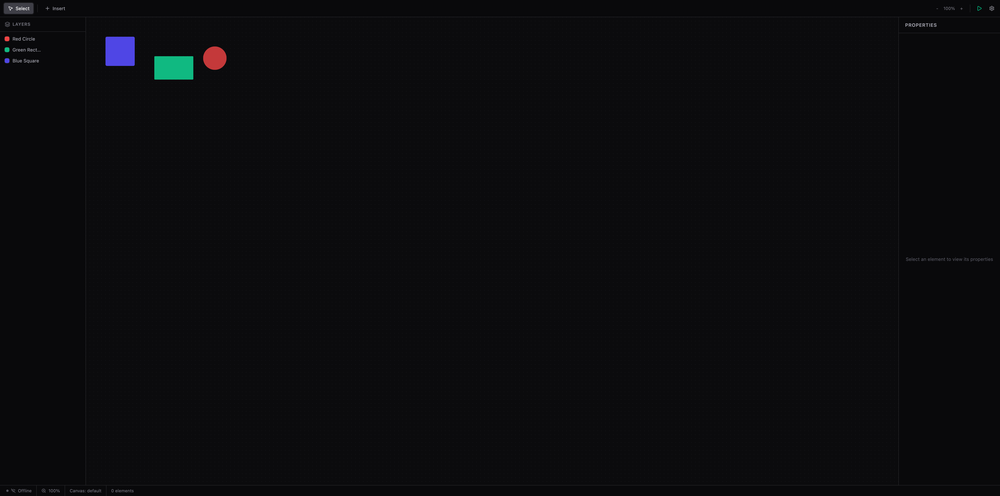
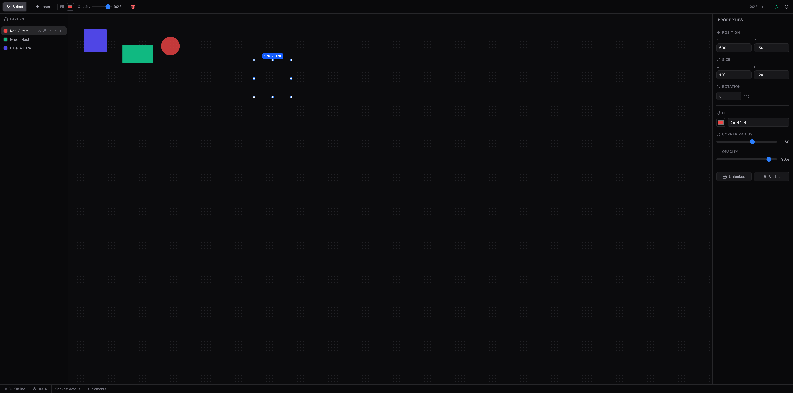

# Onlook Clone


Edit 03-08-2026: it's still very early stage, the fruit of the idea is coming from the frustration of having to always go into code. What if you instead could change something on the slider?

A visual editor for building web interfaces, featuring a Rust/WASM/WebGPU performance engine with progressive enhancement.

## Screenshots

| Editor Overview | Element Selected |
|---|---|
|  |  |

## Architecture

```
┌─────────────────────────────────────────────────────────┐
│                  SvelteKit Frontend                      │
│               (Canvas + Panels + Toolbar)                │
│                                                          │
│  ┌──────────────────────────────────────────────────┐   │
│  │         Rust/WASM Performance Engine              │   │
│  │  ┌──────┐ ┌─────────┐ ┌──────┐ ┌────────┐       │   │
│  │  │ geom │ │ spatial │ │ diff │ │ render │       │   │
│  │  └──────┘ └─────────┘ └──────┘ └────────┘       │   │
│  └──────────────────────────────────────────────────┘   │
├─────────────────────────────────────────────────────────┤
│       Phoenix Realtime        │     Go Diff Engine      │
│     (WebSocket channels)      │   (operational xform)   │
├─────────────────────────────────────────────────────────┤
│                    Rails API                             │
│              (CRUD + persistence)                        │
├─────────────────────────────────────────────────────────┤
│                  PostgreSQL 17                           │
└─────────────────────────────────────────────────────────┘
```

## Tech Stack

| Layer | Technology | Purpose |
|---|---|---|
| Frontend | SvelteKit 2 + Svelte 5 | Canvas rendering, UI panels, reactivity |
| Styling | Tailwind CSS 4 | Utility-first styling |
| API | Ruby on Rails 8 | REST endpoints, persistence |
| Realtime | Phoenix (Elixir) | WebSocket channels, presence |
| Diff Engine | Go | Operational transformation |
| Performance | Rust → WebAssembly | Geometry, spatial indexing, diffing |
| GPU Rendering | WebGPU + WGSL shaders | Hardware-accelerated canvas |
| Database | PostgreSQL 17 | Primary data store |
| Containerization | Docker Compose | Multi-service orchestration |

## Progressive Enhancement

The WASM engine loads progressively — the editor works without it and gets faster as modules load:

| Tier | Modules | Capability |
|---|---|---|
| **Tier 0** | None (JS fallback) | Full editor functionality via JavaScript |
| **Tier 1** | `wasm-geom` | Fast matrix math, point-in-shape hit testing |
| **Tier 2** | + `wasm-spatial` | R-tree spatial index for viewport queries |
| **Tier 3** | + `wasm-diff` + `wasm-render` | Binary diffing + WebGPU canvas rendering |

## Getting Started

### Prerequisites

- **Node.js 20+** and **bun** (or npm)
- **Ruby 3.3+** and Bundler
- **Elixir 1.17+**
- **Go 1.22+**
- **Rust** with `wasm-pack` (`cargo install wasm-pack`)
- **PostgreSQL 17** (or use Docker)
- **Docker** and **Docker Compose** (optional, for containerized setup)

### Quick Start (Docker)

```bash
make up        # Start all services
make seed      # Seed sample elements
```

Open http://localhost:5173

### Local Development

```bash
# Install all dependencies
make setup

# Build WASM modules
make wasm

# Start each service (in separate terminals)
cd api && bin/rails server           # Port 3000
cd realtime && mix phx.server        # Port 4000
cd engine && go run ./cmd/server     # Port 8080
cd frontend && bun run dev           # Port 5173
```

## Project Structure

```
├── frontend/          SvelteKit app
│   └── src/lib/
│       ├── components/    Canvas, panels, toolbar
│       ├── stores/        Element & selection state (Svelte 5 runes)
│       ├── services/      API client, WebSocket, undo/redo
│       └── wasm/          WASM loader + typed wrappers
├── api/               Rails API (CRUD, persistence)
├── realtime/          Phoenix (WebSocket channels)
├── engine/            Go diff engine (operational transform)
├── wasm/              Rust workspace
│   └── crates/
│       ├── geom/      Matrix ops, hit testing
│       ├── spatial/   R-tree spatial index
│       ├── diff/      Binary element diffing
│       └── render/    WebGPU renderer + WGSL shaders
├── docs/              Screenshots and documentation
├── docker-compose.yml Multi-service orchestration
└── Makefile           Build and dev commands
```

## WASM Performance Engine

Four Rust crates compile to WebAssembly, each with a TypeScript wrapper that includes an inline JavaScript fallback:

- **`wasm-geom`** — 2D/3D matrix transforms, point-in-polygon and point-in-ellipse hit testing
- **`wasm-spatial`** — R-tree spatial index using the `rstar` crate for fast viewport culling and nearest-neighbor queries
- **`wasm-diff`** — Binary diffing of element state for efficient sync over WebSocket
- **`wasm-render`** — WebGPU rendering pipeline with WGSL shaders for elements and grid

Build and test:

```bash
cd wasm && cargo check    # Verify compilation
cargo test                # Run 16 unit tests
make wasm                 # Build all crates via wasm-pack
```

## License

MIT
